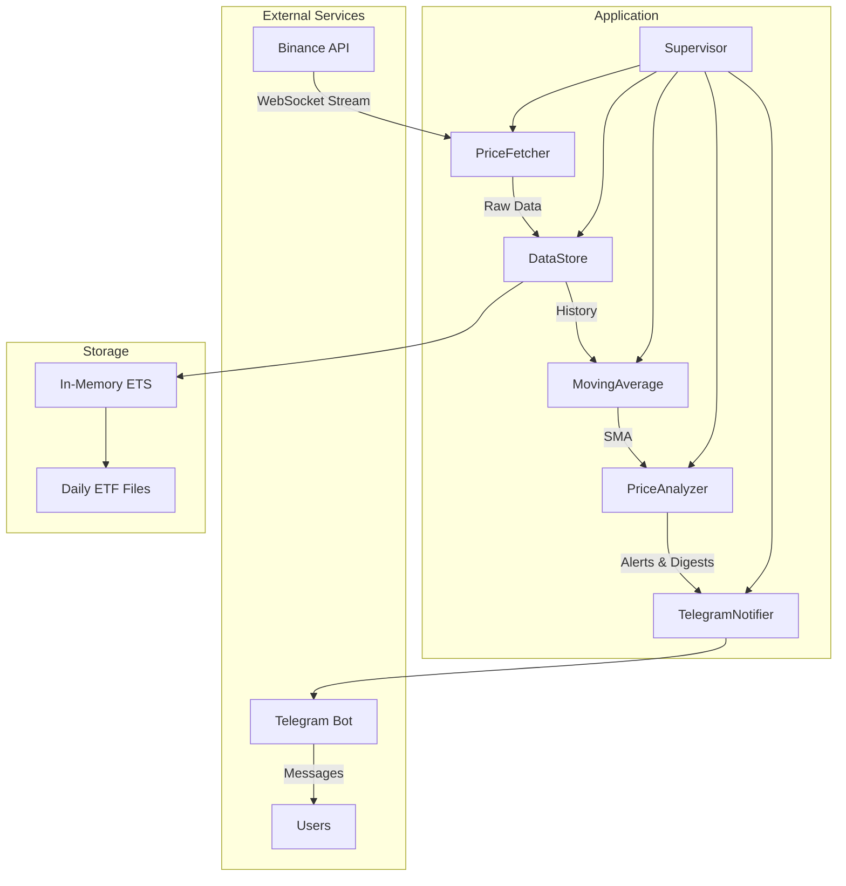

# CryptoTracker - Real-time Bitcoin Price Monitor

A real-time Bitcoin price monitoring system built with Elixir, leveraging Binance's WebSocket API to track BTC/USDT price movements and deliver alerts via Telegram. The system features both continuous price analysis and regular market digests.

Related projects by topic:

[Usage of OTP to build a Cart system with LiveView](https://github.com/Maartz/kantox_live)

[Crypto tracker with 2 exchanges and LiveView (out of date)](https://github.com/Maartz/allcoins)

## Architecture



## Design Decisions

Several key design decisions shape the application's architecture:

1. **Data Storage Strategy**
   - In-memory ETS tables for real-time access to recent data
   - Daily ETF files for historical data archival
   - 24-hour data retention in memory for smooth day boundary transitions

2. **Alert Management**
   - 5-minute cooldown between similar alerts prevents notification fatigue
   - Asynchronous notification dispatch ensures system responsiveness
   - HTML formatting for clear, emoji-enhanced Telegram messages

3. **Performance Optimization**
   - WebSocket data throttling to manage system load
   - Efficient state management through GenServer processes
   - Smart caching of calculations to prevent redundant processing

## Key Features

Our system provides comprehensive Bitcoin price monitoring through:

A dual notification system delivers both real-time alerts and regular market updates:

- **Price Movement Alerts**: Instant notifications when:
  - Price deviates from 5-minute SMA by more than 2%
  - New 24-hour highs or lows are reached
  
- **Minute-by-Minute Digests**: Regular updates containing:
  - Current BTC price
  - 24-hour high and low
  - 24-hour trading volume
  - 5-minute Simple Moving Average

## Technical Highlights

The application demonstrates several interesting technical decisions:

- **Efficient Data Storage**: Uses ETS tables for lightning-fast in-memory access to recent data, with daily archival to ETF files. I've found the ETF (Erlang Term Format) naming quite amusing given I'm building a financial tool.

- **Real-time Processing**: Maintains continuous WebSocket connection to Binance, processing price updates in real-time while implementing smart throttling to prevent system overload.

- **State Management**: Leverages Elixir's GenServer behavior for reliable state management, including a sophisticated alert deduplication system to prevent notification spam.

- **Fault Tolerance**: OTP supervision tree ensures system stability and automatic recovery from component failures.

## Libraries and Dependencies

My application relies on several key libraries, each chosen for specific reasons:

 - WebSockex (~> 0.4.3): After initially trying websocket_client, I switched to WebSockex for its better stability and more Elixir-native approach to WebSocket connections. It provides better error handling and a more intuitive API for our Binance integration.

- Tesla (~> 1.8): Handles the HTTP interactions with Telegram's API. I chose Tesla for its middleware system that makes it easy to handle JSON encoding/decoding and add features like retry logic.

- Jason (~> 1.4): JSON parser of choice for its excellent performance characteristics and widespread community adoption. Used for both Binance data parsing and Telegram API interactions.

## Core Design Decisions and Their Implications

Throughout development, I've made several significant architectural decisions that shape how the system works:

### Storage Strategy

I've implemented a dual-storage approach using ETS tables and ETF files. This decision has both benefits and limitations:

#### Benefits:

- Lightning-fast access to recent price data through in-memory ETS tables
- Efficient historical data storage through daily ETF files
- Natural segregation of hot and cold data

#### Limitations:

- Memory usage grows with the frequency of price updates
- No built-in data compression for ETF files
- Need to manage storage cleanup manually

### Real-time Processing

The real-time processing pipeline makes certain tradeoffs:

#### Benefits:

- 1-second analysis cycle provides near-real-time price movement detection
- Throttling prevents system overload from high-frequency updates
- Asynchronous notification dispatch prevents processing bottlenecks

#### Limitations:

- Small possibility of missing extremely brief price spikes
- No guarantee of exact timing for minute digests due to Erlang's timing system
- Alert cooldown might mask repeated significant movements

### Known Limitations and Future Improvements

The current implementation has several areas that could be enhanced:

#### Data Persistence:

- Currently no backup mechanism for ETF files
- No automatic cleanup of old ETF files
- No data compression implementation

#### Error Handling:

- WebSocket reconnection could be more sophisticated
- No automatic recovery from Telegram API rate limits
- Limited handling of network partitions


#### Scalability:

- Single node only - no distributed capabilities
- No built-in monitoring or metrics collection (like AppSignal)
- Memory usage grows linearly with price update frequency


### Assumptions and Their Impact
While building this system, I've made several key assumptions that influence its behavior:

Network Reliability:

- I assume relatively stable connections to both Binance and Telegram
- Brief disconnections are handled, but extended outages might require manual intervention

Data Consistency:

- I trust Binance's data accuracy implicitly
- No cross-validation with other exchanges
- Volume data might not include all trading pairs

User Behavior:

- Assumes users can handle up to 1 message per minute
- Alert thresholds are fixed rather than user-configurable (2%)
- No mechanism for users to temporarily disable notifications (Maybe a snooze feature)

### Finally: Try it Yourself!

If you want to see this system in action? 

You can interact with our Bitcoin price monitoring bot directly through Telegram:
[@MaartzAlertBot](https://t.me/MaartzAlertBot) is live and monitoring BTC/USDT prices 24/7. 

Simply start a chat with the bot to begin receiving messages


## Local Development Setup

1. **Clone the Repository**
```bash
git clone https://github.com/yourusername/crypto_tracker.git
cd crypto_tracker
```

2. **Environment Configuration**

Create a `.env` file in the project root:
```
TELEGRAM_BOT_TOKEN=your_bot_token_here
TELEGRAM_CHAT_ID=your_chat_id_here
```

To get your chat ID:
- Say 👋 to the BotFather in first place to create your bot
- Start a conversation with your bot on Telegram
- Send any message to the bot
- curl https://api.telegram.org/bot<YOUR_BOT_TOKEN>/getUpdates
- Look for the "chat" : { "id" : HERE_IS_YOUR_CHAT_ID } inside the JSON

3. **Install Dependencies**
```bash
mix deps.get
```

4. **Start the Application**

First, load your environment variables:
```bash
source .env
```

Then start the application:
```bash
iex -S mix
```

## Production Deployment (Fly.io)

1. **Install Fly CLI**
```bash
curl -L https://fly.io/install.sh | sh
```

2. **Login to Fly.io**
```bash
fly auth login
```

3. **Deploy the Application**
```bash
# Initialize Fly.io application
fly launch

# Set environment variables
fly secrets set TELEGRAM_BOT_TOKEN=your_token_here
fly secrets set TELEGRAM_CHAT_ID=your_chat_id_here

// Usually Fly will autodeploy after each secret being added via CLI
// but we can enforce it via deploy

# Deploy
fly deploy
```
